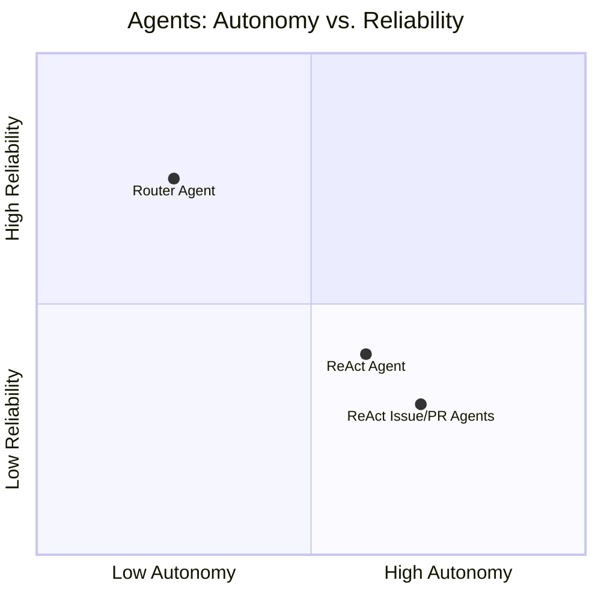
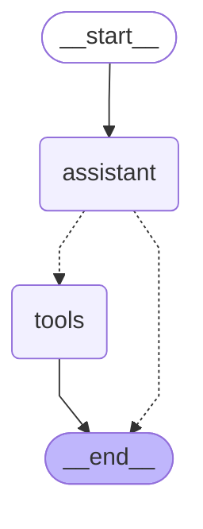
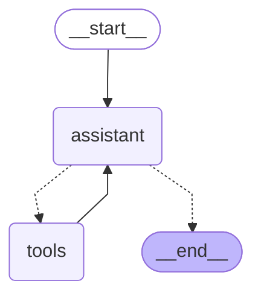

# Fabric Agent Action

[](https://github.com/xvnpw/fabric-agent-action/actions/workflows/ci.yaml)

🤖 **Fabric Agent Action** is a GitHub Action that leverages [Fabric Patterns](https://github.com/danielmiessler/fabric/tree/main/patterns) to automate complex workflows using an agent-based approach. Built with [LangGraph](https://www.langchain.com/langgraph), it intelligently selects and executes patterns using Large Language Models (LLMs).

## Features

- **Seamless Integration:** Easily incorporate the action into your existing workflows without additional setup.
- **Multi-Provider Support:** Choose between OpenAI, OpenRouter, or Anthropic based on your preference and availability.
- **Configurable Agent Behavior:** Select agent types (`router`, `react`, `react_issue` or `react_pr`) and customize their behavior to suit your workflow needs.
- **Flexible Pattern Management:** Include or exclude specific Fabric Patterns to optimize performance and comply with model limitations.

## Setup

Add the Fabric Agent Action to your workflow by referencing it in your `.yaml` file:

```yaml
- name: Execute Fabric Agent Action
  uses: xvnpw/fabric-agent-action@v0.0.28
  with:
    input_file: path/to/input.md
    output_file: path/to/output.md
  env:
    OPENAI_API_KEY: ${{ secrets.OPENAI_API_KEY }}
```

Set Environment Variables: Ensure you set the required API keys in your repository's secrets.

## Security

**⚠️ Important:** Before using this action, implement protections against unauthorized use, especially in public repositories. Unauthorized usage can lead to excessive API consumption and incur costs.

Use workflow conditions to limit who can run this action:

| Type | Abuse Description | Example Protecting Condition |
| --- | --- | --- |
| Pull request  | Pull requests can originate from forks | `if: github.event.pull_request.head.repo.full_name == github.repository` |
| Pull request comment | Pull requests can originate from forks. It's not possible to check it in the same way as pull request, because event type is different. | `github.event.comment.user.login == github.event.repository.owner.login` and `if (pr.data.head.repo.owner.login !== context.repo.owner)` |
| Issue comment | Anyone can create issues and add comments on public repositories | `github.event.comment.user.login == github.event.repository.owner.login` |

## Configuration

### Action Inputs

| Input | Description | Default |
|-------|-------------|---------|
| `input_file` | **Required** Source file containing input and agent instructions | |
| `output_file` | **Required** Destination file for pattern results | |
| `verbose` | Enable INFO level logging | `false` |
| `debug` | Enable DEBUG level logging | `false` |
| `agent_type` | Agent behavior model (`router`/`react`/`react_issue`/`react_pr`) | `router` |
| `agent_provider` | LLM provider for agent (`openai`/`openrouter`/`anthropic`) | `openai` |
| `agent_model` | Model name for agent | `gpt-4o` |
| `agent_temperature` | Model creativity (0-1) for agent | `0` |
| `agent_preamble_enabled` | Enable preamble in output | `false` |
| `agent_preamble` | Preamble added to the beginning of output | `##### (🤖 AI Generated)` |
| `fabric_provider` | Pattern execution LLM provider | `openai` |
| `fabric_model` | Pattern execution LLM model | `gpt-4o` |
| `fabric_temperature` | Pattern execution creativity (0-1) | `0` |
| `fabric-patterns-included` | Patterns to include (comma-separated). **Required for models with pattern limits (e.g., `gpt-4o`).** | |
| `fabric-patterns-excluded` | Patterns to exclude (comma-separated) | |
| `fabric_max_num_turns` | Maximum number of turns to LLM when running fabric patterns | 10 |

> **Note:** Models like `gpt-4o` have a limit on the number of tools (128), while Fabric currently includes 175 patterns (as of November 2024). Use `fabric_patterns_included` or `fabric_patterns_excluded` to tailor the patterns used. For access to all patterns without tool limits, consider using `claude-3-5-sonnet-20240620`.

Find the list of available Fabric Patterns [here](https://github.com/danielmiessler/fabric/tree/main/patterns).

### Required Environment Variables

Set one of the following API keys:

- `OPENAI_API_KEY`
- `OPENROUTER_API_KEY`
- `ANTHROPIC_API_KEY`

## Usage Example

This action is flexible in workflow integration and can be used on issues, pushes, etc.

### Issue Comments - Created or Edited

Below is an example of how to integrate the Fabric Agent Action into a GitHub Actions workflow that reacts to issue comments:

```yaml
name: Fabric Pattern Processing using ReAct Issue Agent
on:
  issue_comment:
    types: [created, edited]

jobs:
  process_fabric:
    if: >
      github.event.comment.user.login == github.event.repository.owner.login &&
      startsWith(github.event.comment.body, '/fabric') &&
      !github.event.issue.pull_request
    runs-on: ubuntu-latest
    permissions:
      issues: write
      contents: write

    steps:
      - name: Checkout
        uses: actions/checkout@v4

      - name: Prepare Input
        uses: actions/github-script@v7
        id: prepare-input
        with:
          script: |
            const issue = await github.rest.issues.get({
              issue_number: context.issue.number,
              owner: context.repo.owner,
              repo: context.repo.repo
            });

            const comment = await github.rest.issues.getComment({
              comment_id: context.payload.comment.id,
              owner: context.repo.owner,
              repo: context.repo.repo
            });

            // Get all comments for this issue to include in the output
            const comments = await github.rest.issues.listComments({
              issue_number: context.issue.number,
              owner: context.repo.owner,
              repo: context.repo.repo
            });

            // Extract command from the triggering comment
            const command = comment.data.body;

            let output = `INSTRUCTION:\n${command}\n\n`;

            // Add issue information
            output += `GITHUB ISSUE, NR: ${issue.data.number}, AUTHOR: ${issue.data.user.login}, TITLE: ${issue.data.title}\n`;
            output += `${issue.data.body}\n\n`;

            // Add all comments
            for (const c of comments.data) {
              if (c.id === comment.data.id) {
                break;
              }
              output += `ISSUE COMMENT, ID: ${c.id}, AUTHOR: ${c.user.login}\n`;
              output += `${c.body}\n\n`;
            }

            require('fs').writeFileSync('fabric_input.md', output);

            return output;

      - name: Execute Fabric Patterns
        uses: docker://ghcr.io/xvnpw/fabric-agent-action:v0.0.28
        with:
          input_file: "fabric_input.md"
          output_file: "fabric_output.md"
          agent_type: "react_issue"
          fabric_temperature: 0.2
          fabric_patterns_included: "clean_text,create_stride_threat_model,create_design_document,review_design,refine_design_document,create_threat_scenarios,improve_writing,create_quiz,create_summary"
          debug: true
        env:
          OPENAI_API_KEY: ${{ secrets.OPENAI_API_KEY }}
          OPENROUTER_API_KEY: ${{ secrets.OPENROUTER_API_KEY }}

      - name: Post Results
        uses: peter-evans/create-or-update-comment@v4
        with:
          issue-number: ${{ github.event.issue.number }}
          body-path: fabric_output.md
```

In this workflow:

- The job runs only when:
  - The comment starts with `/fabric`.
  - The comment author is the repository owner.
  - The issue is not a pull request.
- This prevents unauthorized users from triggering the action, avoiding excessive API usage or costs.

### More Examples

| Example | Links |
| --- | --- |
| Create a pull request on changes in `README.md` to run the [improve_writing pattern](https://github.com/danielmiessler/fabric/blob/main/patterns/improve_writing/system.md) | [Pull request](https://github.com/xvnpw/fabric-agent-action-examples/pull/4), [workflow](https://github.com/xvnpw/fabric-agent-action-examples/blob/main/.github/workflows/fabric-readme-pr.yml) |
| Create a pull request on changes in the `docs/` directory to run the `improve_writing` pattern | [Pull request](https://github.com/xvnpw/fabric-agent-action-examples/pull/8), [workflow](https://github.com/xvnpw/fabric-agent-action-examples/blob/main/.github/workflows/fabric-docs-pr.yml) |
| Run fabric patterns from issue comments using the [router agent](#router-agent) | [Issue](https://github.com/xvnpw/fabric-agent-action-examples/issues/5), [workflow](https://github.com/xvnpw/fabric-agent-action-examples/blob/main/.github/workflows/fabric-issue-agent-router.yml) |
| Run fabric patterns from issue comments using the [react agent](#react-agent) | [Issue](https://github.com/xvnpw/fabric-agent-action-examples/issues/6), [workflow](https://github.com/xvnpw/fabric-agent-action-examples/blob/main/.github/workflows/fabric-issue-agent-react.yml) |
| Automatically run the fabric [write_pull_request pattern](https://github.com/danielmiessler/fabric/blob/main/patterns/write_pull-request/system.md) on pull requests | [Pull request](https://github.com/xvnpw/fabric-agent-action-examples/pull/7), [workflow](https://github.com/xvnpw/fabric-agent-action-examples/blob/main/.github/workflows/fabric-pr-diff.yml) |

## Agent Types

The action supports different types of agents that process fabric patterns. Each agent has specific capabilities and use cases.



In practice, there's often a trade-off between autonomy and reliability. Increasing LLM autonomy can sometimes reduce reliability due to factors like non-determinism or errors in tool selection.

### Router Agent (`router`)

The simplest agent that makes a single pattern selection and returns direct output. It follows a straightforward flow:
1. Receives input
2. Selects appropriate tool (pattern)
3. Returns tool output



**Input Example:**

```markdown
/fabric improve writing

I encountered a challenge in creating high-quality design documents [...]
```

### ReAct Agent (`react`)

A more sophisticated agent that implements the ReAct pattern (Reason-Act-Observe). Features:
- Can make multiple tool calls in sequence
- Reasons about tool outputs
- Configurable maximum turns via `fabric_max_num_turns`



**Input Example:**

```markdown
/fabric clean text and improve writing

I encountered a challenge in creating high-quality design documents [...]
```

### Specialized GitHub Agents

Two variants of ReAct agent optimized for GitHub interactions:

1. ReAct Issue Agent: Processes GitHub Issues
   - Handles structured input with INSTRUCTION, ISSUE, and COMMENTS
   - Maintains context from previous interactions
   - Preserves exact tool outputs

2. ReAct Pull Request Agent: Processes Pull Requests
   - Similar to Issue agent but includes GIT DIFF analysis
   - Processes INSTRUCTION, PR description, and comments
   - Can analyze code changes through diff

#### ReAct Issue Agent `react_issue`

**Example Input:**

```markdown
INSTRUCTION:
/fabric improve writing of cleaned text

GITHUB ISSUE, NR: 1233, AUTHOR: xvnpw, TITLE: Text improvements
I encountered a challenge in     creating high-quality design documents for my threat modeling research..... About a year and a half ago, I created AI Nutrition-Pro architecture and have been using it since then. What if it's already in LLMs' training data? Testing threat modeling capabilities could give me false results.

ISSUE COMMENT, ID: 12321434, AUTHOR: xvnpw
/fabric clean text

ISSUE COMMENT, ID: 12313245, AUTHOR: github-action[bot]
I encountered a challenge in creating high-quality design documents for my threat modeling research. About a year and a half ago, I created AI Nutrition-Pro architecture and have been using it since then. What if it's already in LLMs' training data? Testing threat modeling capabilities could give me false results.

ISSUE COMMENT, ID: 32425444, AUTHOR: pedro
I think writing about training data is inrelevent. We don't really know what is in those data.
```

#### ReAct Pull Request Agent `react_pr`

**Example Input:**

```markdown
INSTRUCTION:
/fabric improve writing of cleaned text

GITHUB PULL REQUEST, NR: 1233, AUTHOR: xvnpw, TITLE: Text improvements
I encountered a challenge in     creating high-quality design documents for my threat modeling research..... About a year and a half ago, I created AI Nutrition-Pro architecture and have been using it since then. What if it's already in LLMs' training data? Testing threat modeling capabilities could give me false results.

GIT DIFF:
diff --git a/.github/workflows/fabric-docs-pr.yml b/.github/workflows/fabric-docs-pr.yml
index 996a93a..ba7d121 100644
--- a/.github/workflows/fabric-docs-pr.yml
+++ b/.github/workflows/fabric-docs-pr.yml
@@ -58,7 +58,7 @@ jobs:
           CHANGED_FILES: ${{ steps.changed_files.outputs.changed_files }}

       - name: Execute Fabric patterns
-        uses: docker://ghcr.io/xvnpw/fabric-agent-action:v0.0.26
+        uses: docker://ghcr.io/xvnpw/fabric-agent-action:v0.0.27^M
         with:
           input_file: "fabric_input.md"
           output_file: "fabric_output.md"
diff --git a/.github/workflows/fabric-issue-agent-react-experimental-issue.yml b/.github/workflows/fabric-issue-agent-react-experimental-issue.yml
index 3850a70..8b8321b 100644
--- a/.github/workflows/fabric-issue-agent-react-experimental-issue.yml
+++ b/.github/workflows/fabric-issue-agent-react-experimental-issue.yml

PULL REQUEST COMMENT, ID: 12321434, AUTHOR: xvnpw
/fabric clean text

PULL REQUEST COMMENT, ID: 12313245, AUYTHOR: github-action[bot]
I encountered a challenge in creating high-quality design documents for my threat modeling research. About a year and a half ago, I created AI Nutrition-Pro architecture and have been using it since then. What if it's already in LLMs' training data? Testing threat modeling capabilities could give me false results.

PULL REQUEST COMMENT, ID: 32425444, AUTHOR: pedro
I think writing about training data is inrelevent. We don't really know what is in those data.
```

All agents will return "no fabric pattern for this request" if they cannot match the input to an appropriate pattern.

## Debugging

You have two ways to gain insights into the internal workings of the system.

### Debug Argument

Enable the `debug` mode by setting the `debug` argument to `true`. This will provide more detailed information about the process.

### LangSmith

[LangSmith](https://www.langchain.com/langsmith) offers a free tier that lets you visually track interactions between agents and LLMs, making debugging easier.

To use LangSmith, set the following environment variables:

- `LANGCHAIN_API_KEY`: `${{ secrets.LANGCHAIN_API_KEY }}`
- `LANGCHAIN_TRACING_V2`: `true`

## Supported LLM Providers

- [OpenAI](https://platform.openai.com/) - Industry standard
- [OpenRouter](https://openrouter.ai/) - Multi-model gateway
- [Anthropic](https://www.anthropic.com/) - Claude models

## Contributing

Contributions are welcome! Please open issues and pull requests. Ensure that you follow the existing code style and include tests for new features.

## License

This project is licensed under the [MIT License](LICENSE).
