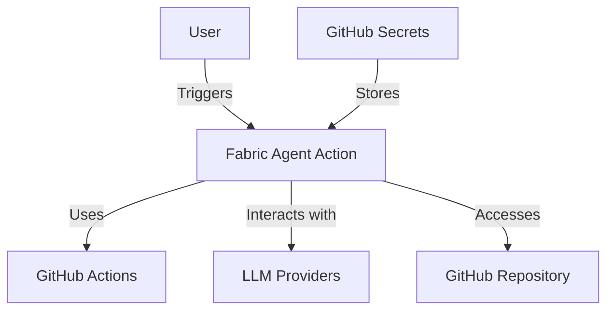
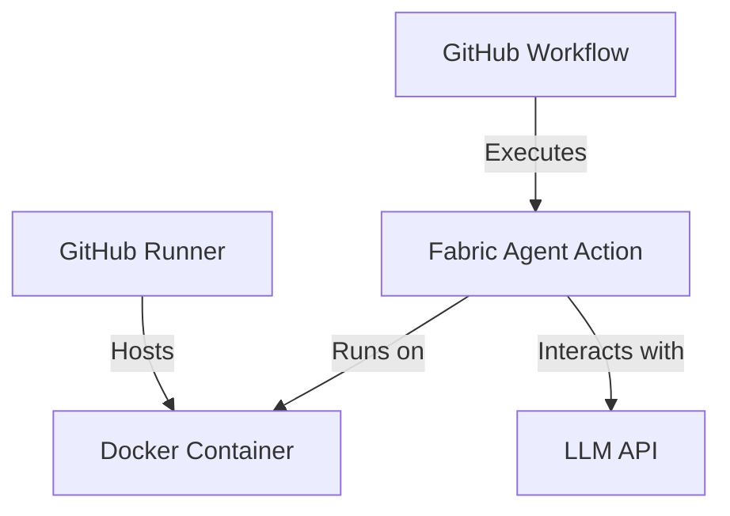
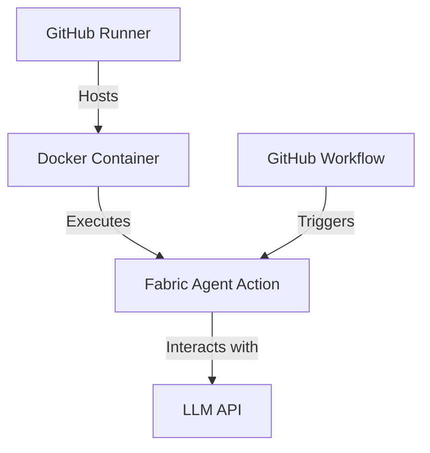
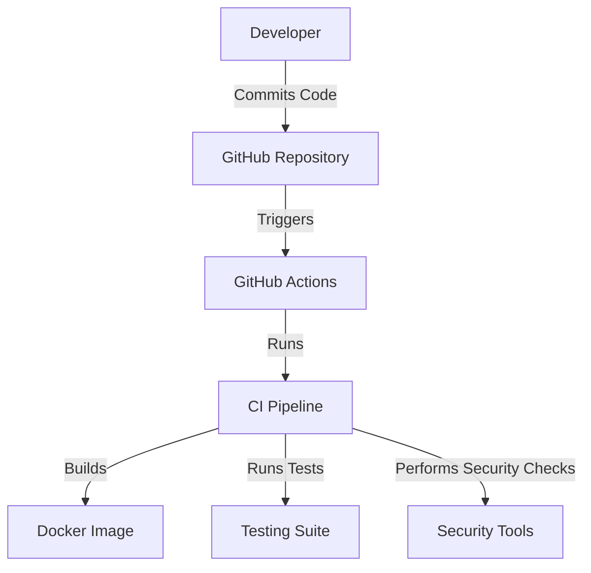

# Fabric Agent Action Design Document

## Business Posture

The Fabric Agent Action is designed to automate complex workflows using an agent-based approach, leveraging Fabric Patterns and Large Language Models (LLMs). The primary business goal is to provide seamless integration into existing workflows, supporting multiple LLM providers, and offering configurable agent behavior. The key business risks include unauthorized usage leading to increased API costs and potential misuse of the action in public repositories.

## Security Posture

### Existing Security Controls

- **Security Control**: Access control patterns are implemented to prevent unauthorized usage, as described in the README under the "Security" section.
- **Security Control**: Environment variables for API keys are required, ensuring that sensitive information is not hardcoded.
- **Security Control**: The CI workflow includes security checks using Bandit to identify potential vulnerabilities in the codebase.

### Accepted Risks

- **Accepted Risk**: The action allows execution of LLM patterns, which could potentially be misused if not properly controlled.
- **Accepted Risk**: Public repositories may allow unauthorized users to comment, which could trigger workflows if not properly restricted.

### Recommended Security Controls

- Implement rate limiting to prevent abuse of the action.
- Enhance logging and monitoring to detect and respond to unauthorized access attempts.

### Security Requirements

- **Authentication**: Use GitHub secrets to store API keys securely.
- **Authorization**: Implement conditions in workflows to restrict execution to authorized users.
- **Input Validation**: Ensure that inputs to the action are sanitized to prevent injection attacks.
- **Cryptography**: Use secure methods to handle and store API keys and other sensitive information.

## Design

### C4 Context

| Name              | Type          | Description                                      | Responsibilities                          | Security Controls                                      |
|-------------------|---------------|--------------------------------------------------|-------------------------------------------|--------------------------------------------------------|
| Fabric Agent Action | System       | Automates workflows using Fabric Patterns and LLMs | Execute patterns, interact with LLMs      | Access control, environment variable for API keys      |
| GitHub Actions    | External System | Platform for running CI/CD workflows             | Execute workflows                         | N/A                                                    |
| LLM Providers     | External System | Provides language models for pattern execution   | Provide LLM services                      | API key authentication                                 |
| GitHub Repository | Data Store    | Stores code and configuration for the action     | Store and manage code                     | Repository permissions                                 |
| User              | Actor         | Initiates workflows                              | Trigger actions                           | GitHub authentication                                  |
| GitHub Secrets    | Data Store    | Stores sensitive information like API keys       | Secure storage of secrets                 | Encrypted storage, access control                      |

### C4 Container

| Name              | Type          | Description                                      | Responsibilities                          | Security Controls                                      |
|-------------------|---------------|--------------------------------------------------|-------------------------------------------|--------------------------------------------------------|
| Fabric Agent Action | Application  | Executes Fabric Patterns using LLMs              | Execute patterns, interact with LLMs      | Access control, environment variable for API keys      |
| Docker Container  | Container     | Isolated environment for running the action      | Provide runtime environment               | Container isolation                                    |
| LLM API           | External API  | Provides language model services                 | Process requests from the action          | API key authentication                                 |
| GitHub Workflow   | Workflow      | Defines the CI/CD process                        | Trigger and manage action execution       | Workflow permissions                                   |
| GitHub Runner     | Host          | Executes workflows in a controlled environment   | Host and execute Docker containers        | Runner security settings                               |

### Deployment

The Fabric Agent Action is deployed as a Docker container within a GitHub Runner environment. It interacts with external LLM APIs to execute patterns and is triggered by GitHub workflows.

| Name              | Type          | Description                                      | Responsibilities                          | Security Controls                                      |
|-------------------|---------------|--------------------------------------------------|-------------------------------------------|--------------------------------------------------------|
| GitHub Runner     | Host          | Executes workflows in a controlled environment   | Host and execute Docker containers        | Runner security settings                               |
| Docker Container  | Container     | Isolated environment for running the action      | Provide runtime environment               | Container isolation                                    |
| Fabric Agent Action | Application  | Executes Fabric Patterns using LLMs              | Execute patterns, interact with LLMs      | Access control, environment variable for API keys      |
| LLM API           | External API  | Provides language model services                 | Process requests from the action          | API key authentication                                 |
| GitHub Workflow   | Workflow      | Defines the CI/CD process                        | Trigger and manage action execution       | Workflow permissions                                   |

### Build

The project uses a CI pipeline defined in GitHub workflows to automate the build and testing process. Security checks are integrated into the build process using tools like Bandit and MyPy.

## Risk Assessment

- **Critical Business Process**: Automating workflows using Fabric Patterns and LLMs.
- **Data Sensitivity**: API keys and other secrets are sensitive and must be protected to prevent unauthorized access and misuse.

## Questions & Assumptions

- **Questions**:
  - How are API keys managed and rotated?
  - What is the process for handling security incidents?
- **Assumptions**:
  - The action will be used in a controlled environment with proper access controls.
  - Users will follow best practices for managing secrets and API keys.